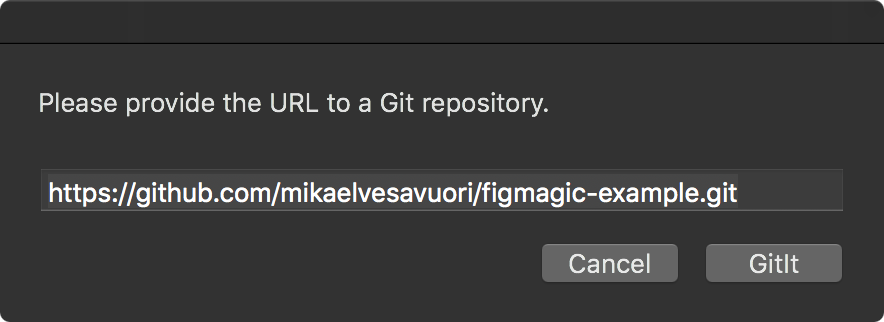
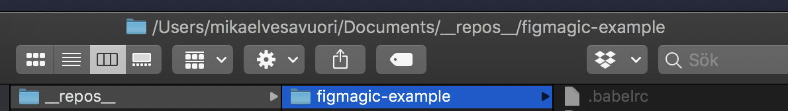
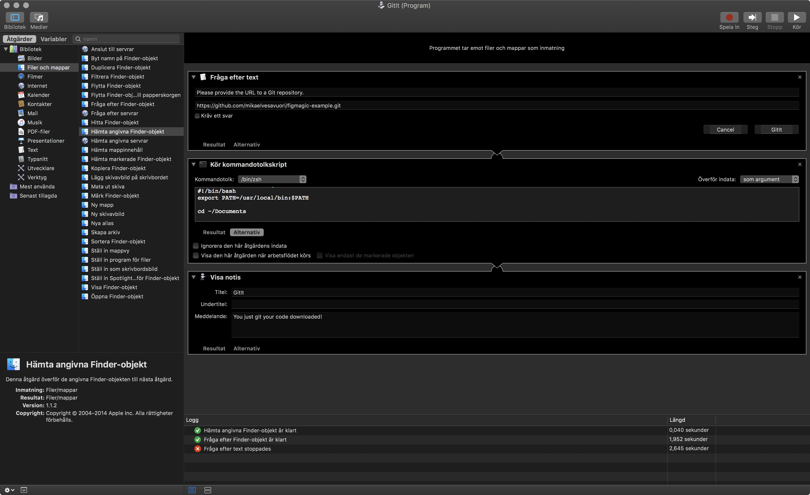

# GitIt

Tiny Mac OS X helper app to clone Git repositories to your Documents folder.

## Prerequisites

- You are running a Mac OS X system

## Using it

- Clone or download this repo
- Place GitIt someplace smart, like in `~/Applications`
- Open GitIt by double-clicking the icon
- Provide the URL to a Git repository, such as `https://github.com/mikaelvesavuori/gitit.git`

_Usage demonstration_

- After a second or two, it should be created under `~/Documents/__repos__/{REPO_NAME}`

_Successfully cloned to your disk_

## Source code

The tiny script that gets run is available under `GitIt.sh`.

## Automator configuration

_How the service is configured in Automator_
